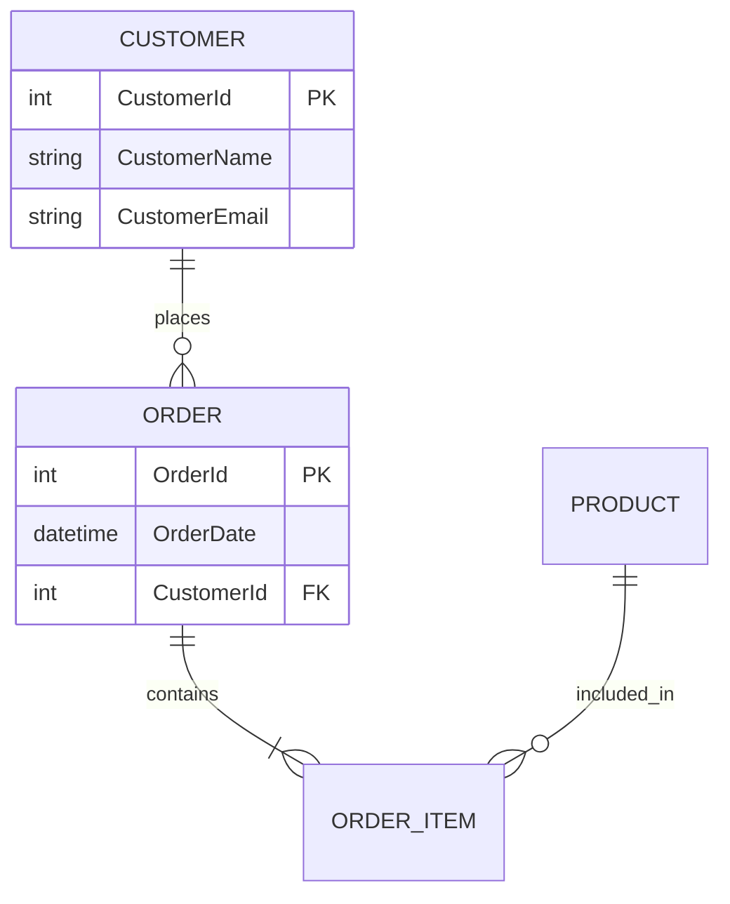
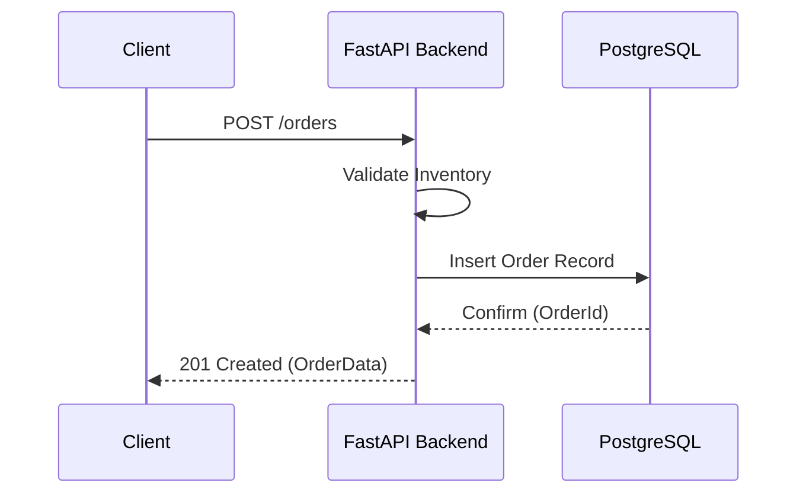

# Systems Analyst & Architect Guide

Esta skill habilita capacidades de análisis de sistemas de nivel senior, priorizando el modelado conceptual y el desarrollo incremental centrado en los datos.

## 1. El Core: Modelado de Datos (GeneXus Style)

El diseño comienza con la definición de las **Entidades (Transacciones)** y sus relaciones. Enfoque en la normalización y la integridad referencial.

- **Atribución Basada en Dominios:** Define nombres de atributos consistentes (e.g., `CustomerId`, `CustomerName`) para permitir la inferencia de relaciones.
- **Normalización Automática:** Diseña pensando en una arquitectura que minimize la redundancia.

### Ejemplo ERD (Mermaid)

## 2. Modelado Funcional (UML Tradicional)

Usa diagramas de secuencia y casos de uso para validar la lógica del sistema antes de codificar.

### Diagrama de Secuencia (Mermaid)

## 3. Metodología Incremental y Ágil

Divide el sistema en **Módulos de Conocimiento** (KBs pequeñas). No intentes diseñar todo el sistema a la vez; construye el núcleo y expande.

- **Paso 1: Requerimiento:** Define la historia de usuario o el caso de uso central.
- **Paso 2: Modelo:** Actualiza el diagrama de clases/ERD.
- **Paso 3: Interfaz:** Define los contratos (OpenAPI) y las pantallas (React/HTML).
- **Paso 4: Implementación:** Genera el código basado en el modelo (centrado en la base de datos).

## 4. Clasificación de Requerimientos

Como analista, siempre debes distinguir y documentar:

1. **Funcionales (RF):** ¿Qué hace el sistema? (e.g., "El usuario podrá emitir facturas").
2. **No Funcionales (RNF):** ¿Cómo lo hace? (e.g., "La respuesta debe ser < 200ms", "Debe soportar 1000 usuarios concurrentes").

## Checklist de Análisis Profesional

- [ ] **Validación de Integridad:** ¿Faltan llaves foráneas o índices?
- [ ] **Escalabilidad:** ¿Podrá el modelo actual soportar volúmenes de datos X veces mayores?
- [ ] **Seguridad:** ¿Quién tiene acceso a qué entidades? (RBAC/ABAC).
- [ ] **Simplicidad:** ¿Es posible reducir la complejidad del modelo sin perder funcionalidad?

---
*Usa esta skill para sentar las bases sólidas de cualquier software antes de escribir la primera línea de código.*
